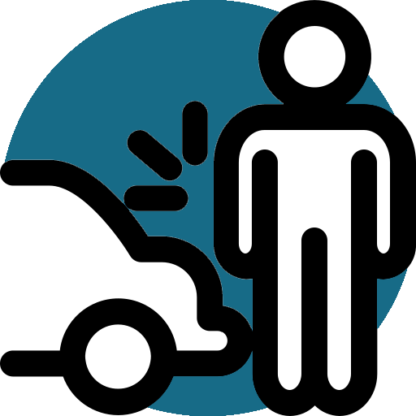

# Traffic Violations Registration Application

The Traffic Violations Registration Application is a mobile application designed to streamline the process of reporting and managing traffic violations. This user-friendly application allows users to report incidents, record details, and maintain a comprehensive record of traffic offenses.

## Key Features

- **Violation Reporting:** Users can easily report traffic violations by providing relevant details such as date, location, type of violation, and additional notes.

  
- **User Management:** The application allows for the management of user accounts, ensuring secure access to the violation registration system.

- **Admin Management:** admin can manage the users and there Violations.
  
- **Vehicle Information:** Users can associate reported violations with specific vehicles, making it easier to track and manage offenses related to each vehicle.

- **Multilingual Support:** The application supports multiple languages, providing a more inclusive experience for users.

## How to Use

1. **Installation:** Download and install the application on your mobile device.

2. **Admin Login:** log in to manage the app.

3. **User Login:** log in to access the violation reporting features.

4. **Report Violations:** Use the intuitive interface to report traffic violations by providing necessary details.

5. **View Records:** Access a comprehensive record of reported violations, including date, location, and type of offense.

## Technologies Used

- **Flutter:** The application is built using the Flutter framework, offering a cross-platform and visually appealing user interface.

- **GetX:** Utilizing the GetX state management library for efficient state handling and navigation.

- **SQLite:** Employing SQLite for the backend database, ensuring data integrity and efficient data retrieval.

## Future Enhancements

The Traffic Violations Registration Application is an evolving project, with plans to incorporate features such as real-time violation tracking, automated alerts, and improved analytics for better traffic management.

**Note:** It's a simple app waiting to be developed 
